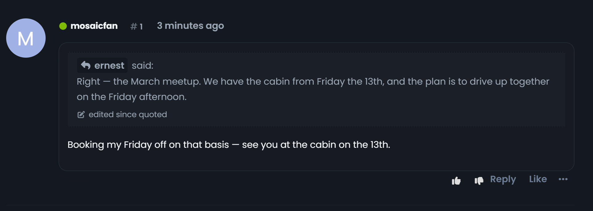

# Verbatim

A quote on a **Flarum 2** forum is a photograph: it keeps the words that were
written, and it keeps them after the post they came from has been rewritten.
That is the right behaviour — a quote that silently followed its source would
let anyone change what they had already been quoted saying.

But nobody is told. The reply still reads as though it answers what is written
up there today.

Verbatim is the missing half sentence.


## What it looks like



The words in the quote are untouched. The line under them says the post they
came from has been edited since this reply was posted, and links to the post as
it stands now.

Hovering it gives the whole story: *"These are the words that were written. The
post they came from was edited 3 minutes ago, after this reply was posted."*

## What it claims, exactly

Only what two timestamps prove: the source post's `editedAt` is **after** the
quoting post's `createdAt`.

Not "this quote is wrong" — nothing records which words were copied when, and a
quoter who fixes a typo in their own reply afterwards has not re-copied
anything. The marker reports the fact and the wording says so. A quote of a
post that was edited *before* the reply was written carries no marker: the
quoter saw that edit.

## How it works

Every quote made with Flarum's quote button already carries its source's id —
`flarum/mentions` renders it as `<a class="PostMention" data-id="9">`. Verbatim
reads that, looks up the source, and compares two dates.

| Piece | What it does |
|---|---|
| `decorate.js` | walks each rendered post for quotes carrying a source id, and marks or unmarks them |
| `sources.js` | one batched `filter[id]` lookup per render for the sources not already loaded |
| `staleness.js` | the comparison, and nothing else |

No tables, no settings, no backend: the extension ships PHP only to register
its assets and locale.

**Sources are fetched through core's own posts endpoint**, so a quote of a post
this reader cannot see returns nothing and is left alone — rather than an
endpoint of our own quietly confirming that a hidden post exists.

**It works with both editors.** Flarum's Markdown composer and
[Scribe](https://github.com/ernestdefoe/scribe) produce different source, but
both end up with the mention in the rendered quote, which is the only thing
this reads.

## What it does not do

- **It does not show what changed.** Flarum core keeps no revision history —
  only that a post was edited, and when.
- **It does not touch the quote.** The words never move. That is the point.

## Installation

```bash
composer require ernestdefoe/verbatim
```

Nothing to configure — enable it and it works.

## Licence

MIT
